# Hot Takes AI Integration - Complete Architecture Diagrams

## Overview

This document contains comprehensive Mermaid diagrams for the AI-powered survey creation pipeline. Each agent is detailed with its tools, autonomy levels, response actions, and data flow.

---

## 1. Main Architecture Overview

---

## 2. Agent 1: Intelligent Intake Agent - Detailed Flow

---

## 3. Agent 2: Research Plan Generator - Detailed Flow

---

## 4. Agent 3: Questionnaire Generator & Game Mapper - Detailed Flow

---

## 5. Agent 4: Auto-Upload & Launch - Detailed Flow

---

## 6. End-to-End Autonomy Progression

```mermaid
flowchart LR
    subgraph Phase1["📊 PHASE 1: AI-POWERED SURVEY CREATION"]
        direction LR
        
        subgraph A1Flow["Agent 1: Intake"]
            direction TB
            A1L1["L1: Co-Pilot<br/>📝 AI Asks → ✋ Human Confirms"]
            A1L2["L2: Supervised<br/>🤖 AI Executes → ⚠️ Flags Ambiguity"]
            A1L3["L3: Full Auto<br/>🚀 AI Runs Solo → 📋 Human Monitors"]
        end
        
        subgraph A2Flow["Agent 2: Research Plan"]
            direction TB
            A2L1["L1: Co-Pilot<br/>📝 AI Generates → ✋ Human Approves"]
            A2L2["L2: Supervised<br/>🤖 AI Creates → ⚠️ Flags Weak Hypotheses"]
            A2L3["L3: Full Auto<br/>🚀 AI Runs Solo → 📋 Maintains Consistency"]
        end
        
        subgraph A3Flow["Agent 3: Questionnaire"]
            direction TB
            A3L1["L1: Co-Pilot<br/>📝 AI Creates → ✋ Human Reviews Each"]
            A3L2["L2: Supervised<br/>🤖 AI Builds → ⚠️ Flags Low Coverage"]
            A3L3["L3: Full Auto<br/>🚀 AI Generates → 📋 Quality Checks"]
        end
        
        subgraph A4Flow["Agent 4: Launch"]
            direction TB
            A4L1["L1: Co-Pilot<br/>📝 AI Prepares → ✋ Human Clicks Launch"]
            A4L2["L2: Supervised<br/>🤖 AI Launches → ⚠️ Flags Warnings"]
            A4L3["L3: Full Auto<br/>🚀 AI Launches → 📋 Notifies When Live"]
        end
    end

    A1Flow -->|Intake Brief| A2Flow
    A2Flow -->|Research Plan| A3Flow
    A3Flow -->|Questionnaire| A4Flow

    style A1Flow fill:#E3F2FD,stroke:#1976D2
    style A2Flow fill:#E8F5E9,stroke:#388E3C
    style A3Flow fill:#FFF3E0,stroke:#F57C00
    style A4Flow fill:#FCE4EC,stroke:#C2185B
```

---

## 7. Complete Data Flow with Autonomy Indicators

```mermaid
flowchart TB
    subgraph L1["LEVEL 1: CO-PILOT (Current Phase 1)"]
        direction TB
        
        B1[👤 Brand Opens Dashboard]
        
        subgraph A1L1["Agent 1: Intelligent Intake"]
            A1Q[AI Asks Questions]
            A1D[AI Drafts Brief]
            H1A[✋ Human Reviews & Approves]
            H1B[📄 Intake Brief<br/>+ Transcript]
        end
        
        subgraph A2L1["Agent 2: Research Plan"]
            A2G[AI Generates Plan]
            A2H[AI Adds Reasoning]
            H2A[✋ Human Reviews & Edits]
            H2B[📄 Research Plan<br/>+ Hypotheses]
        end
        
        subgraph A3L1["Agent 3: Questionnaire"]
            A3G[AI Generates Questions]
            A3M[AI Maps Templates]
            A3C[AI Checks Coverage]
            H3A[✋ Human Reviews Each Q]
            H3B[📄 Questionnaire<br/>+ Mappings]
        end
        
        subgraph A4L1["Agent 4: Auto-Launch"]
            A4V[AI Validates]
            A4P[AI Prepares Upload]
            H4A[✋ Human Clicks Launch]
            H4B[🚀 Survey Live]
        end
        
        B1 --> A1L1
        A1Q --> A1D --> H1A --> H1B
        H1B --> A2L1
        A2G --> A2H --> H2A --> H2B
        H2B --> A3L1
        A3G --> A3M --> A3C --> H3A --> H3B
        H3B --> A4L1
        A4V --> A4P --> H4A --> H4B
    end

    style A1L1 fill:#E3F2FD,stroke:#1976D2
    style A2L1 fill:#E8F5E9,stroke:#388E3C
    style A3L1 fill:#FFF3E0,stroke:#F57C00
    style A4L1 fill:#FCE4EC,stroke:#C2185B
```

---

## 8. Summary: Tools Per Agent

| Agent | Primary Tools | Knowledge Sources | Output | Autonomy Level |
|-------|--------------|-------------------|--------|----------------|
| **1. Intelligent Intake** | Chat UI, NLU Engine, Entity Extraction, Context Manager | Brand Profile, Industry Patterns | Intake Brief, Transcript, Entities | L1: AI drafts → Human approves |
| **2. Research Plan Generator** | Hypothesis Engine, Methodology DB, Reasoning Module, Version Control | Research Frameworks, Methodologies | Research Plan, Hypotheses, Reasoning | L1: AI generates → Human edits |
| **3. Questionnaire Generator** | Question Bank, Template Matcher, Coverage Checker, Format Selector | Game Templates (10-12), Question Types | Questionnaire, Mappings, Coverage Report | L1: AI creates → Human reviews |
| **4. Auto-Upload & Launch** | Supabase Writer, Validator, Launch Controller, Monitor | Supabase Schema, Validation Rules | Survey ID, Logs, Dashboard Access | L1: AI prepares → Human launches |

---

*Document generated for Hot Takes AI Integration Project*
